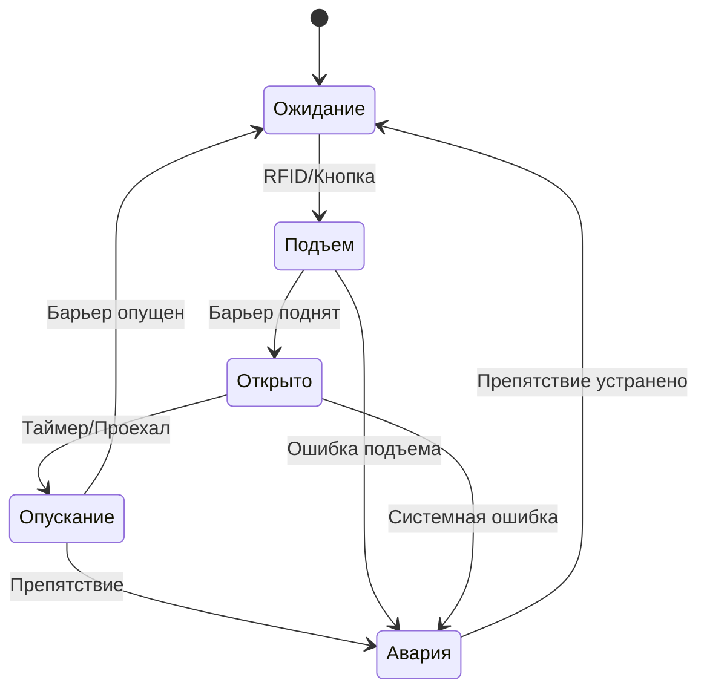

# Техническое задание: Автоматический парковочный барьер

## Общее описание

Система автоматического управления парковочным барьером предназначена для контроля доступа транспортных средств на охраняемую территорию. Система обеспечивает автоматическое открытие барьера при предъявлении авторизованной RFID-карты или по запросу посетителя.

## Функциональные требования

### 1. Система идентификации
- **RFID контроль:** Считывание карт сотрудников на частоте 13.56 МГц
- **Кнопка вызова:** Для посетителей с возможностью дистанционного открытия
- **Дистанционное управление:** Кнопки экстренного подъема/опускания

### 2. Детекция транспорта
- **Индукционные петли:** Датчики присутствия автомобиля на въезде и выезде
- **Безопасность:** Предотвращение опускания барьера на автомобиль
- **Размещение:** 2м до барьера (въезд), 2м после барьера (выезд)

### 3. Управление барьером
- **Автоматическое управление:** Подъем при валидации доступа
- **Контроль времени:** 30 секунд на проезд
- **Позиционирование:** Концевые выключатели положений
- **Двигатель:** Реверсивный привод 380В

### 4. Система безопасности
- **Детекция препятствий:** Остановка при обнаружении авто под барьером
- **Аварийная сигнализация:** Звуковая и световая индикация
- **Экстренное управление:** Ручные кнопки для охраны
- **Журналирование:** Запись всех событий доступа

### 5. Индикация и сигнализация
- **Светофор:** Красный/зеленый сигналы разрешения проезда
- **Звуковые сигналы:** Подтверждение доступа и аварийные сигналы
- **Световое табло:** "ВЪЕЗД ЗАПРЕЩЕН"
- **Освещение зоны:** Автоматическое включение

## Технические характеристики

### Входы системы
| Вход | Описание | Тип сигнала | Назначение |
|------|----------|-------------|------------|
| I1 | RFID считыватель | 24В DC | Валидная карта |
| I2 | Кнопка вызова | 24В DC | Запрос посетителя |
| I3 | Датчик въезда | 24В DC | Авто на въезде |
| I4 | Датчик выезда | 24В DC | Авто на выезде |
| I5 | Концевик "верх" | 24В DC | Барьер поднят |
| I6 | Концевик "низ" | 24В DC | Барьер опущен |
| I7 | Экстренный подъем | 24В DC | Кнопка охраны |
| I8 | Экстренное опускание | 24В DC | Кнопка охраны |

### Выходы системы
| Выход | Описание | Тип нагрузки | Мощность |
|-------|----------|--------------|----------|
| Q1 | Мотор подъема | Контактор | 380В, 3кВт |
| Q2 | Мотор опускания | Контактор | 380В, 3кВт |
| Q3 | Зеленый свет | Лампа | 220В, 100Вт |
| Q4 | Красный свет | Лампа | 220В, 100Вт |
| Q5 | Освещение | Прожектор | 220В, 500Вт |
| Q6 | Звуковой сигнал | Зуммер | 24В, 10Вт |
| Q7 | Сирена | Сирена | 24В, 50Вт |
| Q8 | Табло | LED табло | 220В, 50Вт |

### Временные параметры
- **T1:** Контроль прохода - 30 секунд
- **T2:** Задержка опускания - 3 секунды
- **T3:** Длительность сирены - 10 секунд
- **T4:** Время подъема барьера - 5 секунд
- **T5:** Время опускания барьера - 3 секунды

## Алгоритм работы

### Диаграмма состояний


### Логика работы по состояниям

#### 1. Режим ожидания
```
Условия:
- Барьер опущен (I6 = 1)
- Нет запроса на доступ

Индикация:
- Красный свет (Q4 = 1)
- Табло "ВЪЕЗД ЗАПРЕЩЕН" (Q8 = 1)
- Освещение по необходимости (Q5)
```

#### 2. Подъем барьера
```
Условие запуска:
- (I1 ИЛИ I2 ИЛИ I7) И I6 И НЕ(I3)

Действия:
- Мотор подъема (Q1 = 1)
- Звуковой сигнал (Q6 = 1, 1 сек)
- Отключение табло (Q8 = 0)
```

#### 3. Барьер открыт
```
Условие входа:
- Барьер поднят (I5 = 1)

Действия:
- Остановка мотора (Q1 = 0)
- Зеленый свет (Q3 = 1)
- Красный свет выкл (Q4 = 0)
- Запуск таймера T1 (30 сек)
- Увеличение счетчика (C1++)
```

#### 4. Опускание барьера
```
Условие запуска:
- (T1 истек ИЛИ I4 освободился) И НЕ(I3) И НЕ(I8)

Действия:
- Задержка T2 (3 сек)
- Мотор опускания (Q2 = 1)
- Красный свет (Q4 = 1)
- Табло включено (Q8 = 1)
```

#### 5. Аварийное состояние
```
Условие входа:
- I3 И Q2 (авто под барьером при опускании)

Действия:
- Остановка мотора (Q2 = 0)
- Сирена (Q7 = 1)
- Запуск таймера T3 (10 сек)
- Красный свет мигает
```

## Система безопасности

### Защита от препятствий
1. **При опускании:** Немедленная остановка при обнаружении авто (I3)
2. **При подъеме:** Контроль тока двигателя на заклинивание
3. **Концевые выключатели:** Защита от переходов за крайние положения

### Аварийные режимы
1. **Сбой питания:** Ручное управление механизмом
2. **Отказ датчиков:** Переход в режим ручного управления
3. **Блокировка:** Экстренные кнопки приоритетны

### Система мониторинга
- Счетчик проездов с сохранением в энергонезависимой памяти
- Журнал событий с временными метками
- Диагностика состояния компонентов
- Передача данных в центральную систему (опционально)

## Требования к оборудованию

### Контроллер
- **Основной:** LOGO! 8 230RC или аналог
- **Входы:** Минимум 8 дискретных 24В
- **Выходы:** Минимум 8 релейных 230В
- **Память:** Энергонезависимая для счетчиков
- **Связь:** Ethernet для мониторинга (опционально)

### Датчики и исполнители
- **RFID считыватель:** 13.56 МГц, выход реле 24В
- **Индукционные петли:** С усилителями, настраиваемая чувствительность
- **Концевые выключатели:** IP65, 24В DC
- **Двигатель барьера:** 380В, 3кВт, реверсивный
- **Светофор:** LED, 220В, красный/зеленый
- **Сирена:** 24В, 110 дБ

### Электропит
